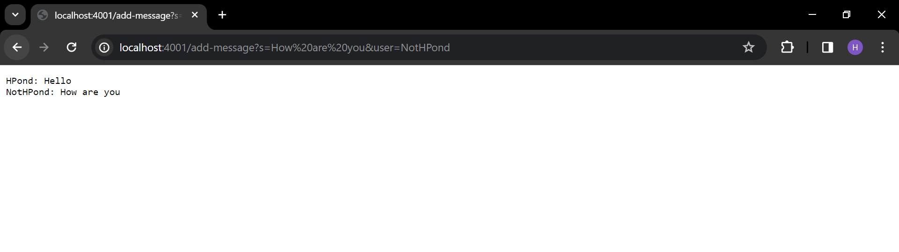

# Lab Report 2 - Henry Pond
## Part 1 - Chat Server

The code for ChatServer.java is as follows:

```
import java.io.IOException;
import java.net.URI;

class Handler implements URLHandler {

    String messageHistory = "";

    public String handleRequest(URI url) {
        if (url.getPath().equals("/")) {
            return messageHistory;
        }
        else if (url.getPath().equals("/add-message")) {
            String[] parameters = url.getQuery().split("=");
            if (parameters[0].equals("s")) {

                String[] chatMessage = parameters[1].split("&");
                String chatUser = parameters[2];
                String fullMessage = chatUser + ": " + chatMessage[0];
                messageHistory = messageHistory + fullMessage + "\n";
                return messageHistory;

            }
            return "Wrong query, need \"s\"";
        } 
        return "404 Not Found!";
    }
}

class ChatServer {
    public static void main(String[] args) throws IOException {
        if(args.length == 0){
            System.out.println("Missing port number! Try any number between 1024 to 49151");
            return;
        }

        int port = Integer.parseInt(args[0]);

        Server.start(port, new Handler());
    }
}
```



