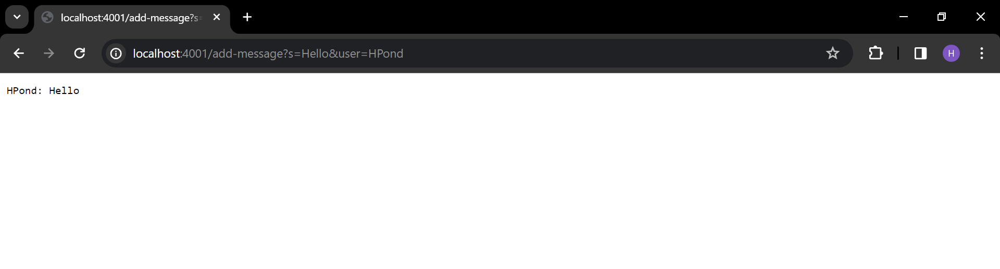
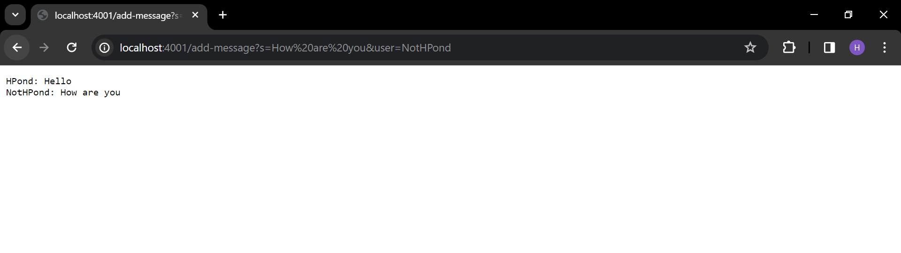
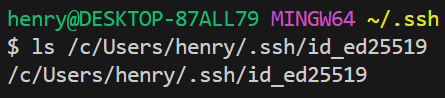
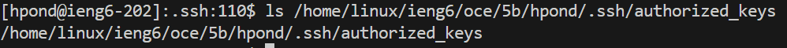
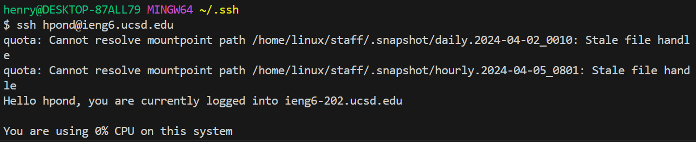

# Lab Report 2 - Henry Pond
## Part 1 - Chat Server

The code for ChatServer.java is as follows:

```
import java.io.IOException;
import java.net.URI;

class Handler implements URLHandler {

    String messageHistory = "";

    public String handleRequest(URI url) {
        if (url.getPath().equals("/")) {
            return messageHistory;
        }
        else if (url.getPath().equals("/add-message")) {
            String[] parameters = url.getQuery().split("=");
            if (parameters[0].equals("s")) {

                String[] chatMessage = parameters[1].split("&");
                String chatUser = parameters[2];
                String fullMessage = chatUser + ": " + chatMessage[0];
                messageHistory = messageHistory + fullMessage + "\n";
                return messageHistory;

            }
            return "Wrong query, need \"s\"";
        } 
        return "404 Not Found!";
    }
}

class ChatServer {
    public static void main(String[] args) throws IOException {
        if(args.length == 0){
            System.out.println("Missing port number! Try any number between 1024 to 49151");
            return;
        }

        int port = Integer.parseInt(args[0]);

        Server.start(port, new Handler());
    }
}
```



When adding this message, the methods called are `getPath()`, `getQuery()`, `split()`, and `equals()`.

`getPath()` and `getQuery()` do not take arguments. `split()` takes in the `=` and `&` characters as arguments to split the string returned by `url.getQuery()` and the string stored in `parameters[1]` respectively into substrings. `equals()` takes in `"/"` and `"/add-message"` as arguments to compare with the path of `url`. The relevant fields are `url`, `parameters[]`, `chatMessage[]`, `chatUser`, `fullMessage`, and `messageHistory`. The value of `url` is `localhost:4001/add-message?s=Hello&user=HPond`. The values of `parameters[]` are as follows: `parameters[0]` is `s`, `parameters[1]` is `Hello&user`, `parameters[2]` is `HPond`. The values of `chatMessage[]` are as follows: `chatMessage[0]` is `Hello`, `chatMessage[1]` is `user`. The value of `chatUser` is `HPond`. The value of `fullMessage` is `HPond: Hello`. The value of `messageHistory` is `HPond: Hello \n`.

All the values of relevant fields have been updated to the values listed above because of the request.



When adding this message, the methods called are `getPath()`, `getQuery()`, `split()`, and `equals()`.

`getPath()` and `getQuery()` do not take arguments. `split()` takes in the `=` and `&` characters as arguments to split the string returned by `url.getQuery()` and the string stored in `parameters[1]` respectively into substrings. `equals()` takes in `"/"` and `"/add-message"` as arguments to compare with the path of `url`. The relevant fields are `url`, `parameters[]`, `chatMessage[]`, `chatUser`, `fullMessage`, and `messageHistory`. The value of `url` is `localhost:4001/add-message?s=How are you&user=NotHPond`. The values of `parameters[]` are as follows: `parameters[0]` is `s`, `parameters[1]` is `How are you&user`, `parameters[2]` is `NotHPond`. The values of `chatMessage[]` are as follows: `chatMessage[0]` is `How are you`, `chatMessage[1]` is `user`. The value of `chatUser` is `NotHPond`. The value of `fullMessage` is `NotHPond: How are you`. The value of `messageHistory` is `HPond: Hello\nNotHPond: How are you\n`.

The values of all relevant fields have been updated to the values listed above with the sole exception of `parameters[0]`.

## Part 2 - ssh keys

Private key, local



Public key, `ieng6.ucsd.edu`



Terminal ieng6 login, no password



## Part 3 - What I've Learned

I learned about the similarities between file paths and URLs. I find it interesting that the domain of a URL acts in a similar manner to the root of an absolute path. Learning about the "anatomy" of URLs, including queries and the hash fragment, was also interesting and is something that I began to notice more often as I browse the web.
