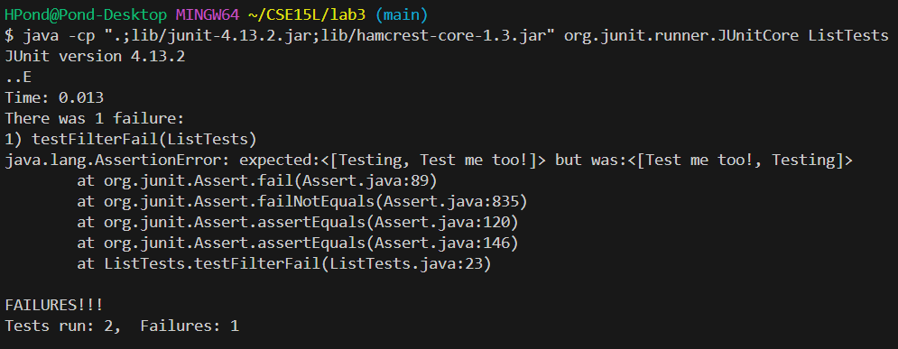

# Lab Report 3 - Henry Pond

## Part 1 - Bugs
I chose to analyze the bug in the `filter` method in `ListExamples.java`. 

### Failure-inducing Test
```
class Check implements StringChecker {
    public boolean checkString(String filter){
        return filter.contains("Test");
    }
}

public class ListTests {
    @Test
    public void testFilterFail() {
        List<String> test = new ArrayList<>();
        test.add("Testing");
        test.add("Not this one");
        test.add("Test me too!");
        List<String> expect = new ArrayList<>();
        expect.add("Testing");
        expect.add("Test me too!");
        Check newCheck = new Check();
        assertEquals(expect,ListExamples.filter(test, newCheck));
    }
}
```

### Successful Test
```
class Check implements StringChecker {
    public boolean checkString(String filter){
        return filter.contains("Test");
    }
}

public class ListTests {
    @Test 
    public void testFilterSuccess() {
        List<String> test = new ArrayList<>();
        test.add("Testing");
        test.add("Not this one");
        test.add("Test me too!");
        test.add("Testing");
        List<String> expect = new ArrayList<>();
        expect.add("Testing");
        expect.add("Test me too!");
        expect.add("Testing");
        Check newCheck = new Check();
        assertEquals(expect,ListExamples.filter(test, newCheck));
    }
}
```

### Test Output


### Fixing The Bug
Before:
```
static List<String> filter(List<String> list, StringChecker sc) {
    List<String> result = new ArrayList<>();
    for(String s: list) {
      if(sc.checkString(s)) {
        result.add(0, s);
      }
    }
    return result;
  }
```

After:
```
static List<String> filter(List<String> list, StringChecker sc) {
    List<String> result = new ArrayList<>();
    for(String s: list) {
      if(sc.checkString(s)) {
        result.add(s);
      }
    }
    return result;
  }
```

### Why It's Fixed
The symptom was that the `filter` method was returning a list of correctly filtered strings in the reverse order of which they appear in the original list.
This is because the method was adding the filtered strings to the beginning of the list instead of the end.
Simply changing `result.add(0, s);` to `result.add(s);` fixes the issue and `filter` will return a list of filtered strings in the order they appear in the original list.

## Part 2 - Researching the `less` Command
`less` is a command used to observe the contents of a file in a more focused and controlled manner than `cat`. It displays the contents of the file line by line, but only a certain number of lines at a time depending on the size of the terminal. The contents of the file can then be "scrolled" through by using the arrow keys to move up and down or side to side. For example, when "scrolling" downwards, the top line is removed from view and the next line in the file is displayed at the bottom of the terminal.

Note: Since the `less` command replaces the terminal completely upon execution, I will paste the exact command I used and the first "page" of output separately. In addition, I will be resizing the terminal so that only eight lines of `less` are displayed to save space on this document.

### `-N` option
This option will cause `less` to display the line number of each line on the left side of the terminal alongside the contents of each line. This is useful for referencing certain lines of certain files without having to manually count the lines.

Example 1:
`less -N technical/911reports/preface.txt`
```
      1 
      2
      3
      4             PREFACE
      5             We present the narrative of this report and the recommendations that flow from it to     
      6                 the President of the United States, the United States Congress, and the American     
      7                 people for their consideration. Ten Commissioners-five Republicans and five
      8                 Democrats chosen by elected leaders from our nation's capital at a time of great     
technical/911report/preface.txt
```

Example 2:
`less -N technical/government/Media/Advocate_for_Poor.txt`
```
      1
      2
      3
      4 
      5 New York Daily News
      6 Tuesday, May 7, 2002
      7
      8 Advocate for Poor Has Own Obstacles
technical/government/Media/Advocate_for_Poor.txt
```

### `-F` option
This option causes `less` to exit automatically if the contents of the file can be displayed on one screen. However, the contents of the file are still displayed in a manner similar to `cat`. This is useful for situations where the functionality of `less` is unnecessary and `cat` would be sufficient. 

In addition, finding a sufficiently short text file within `./technical` required me to utilize the `find`, `wc`, and `sort` commands we learned about in lab this past week!

Note: For the purpose of this example, I will be displaying more lines of `less`.

Example 1:
`less -F technical/government/Media/Advocate_for_Poor.txt`
```


New York Daily News
Tuesday, May 7, 2002

Advocate for Poor Has Own Obstacles
Greg Wilson
Former prosecutor Michael Mazzariello was finally doing the kind
of legal work he'd always dreamed of, but after less than a year of
helping East New York's poor, he's getting booted from the bodega
he turned into an office.
Nearly a year ago, Mazzariello, a former assistant district
attorney who grew up in East New York, started a nonprofit practice
helping the working poor navigate the legal system. Immigration,
landlord-tenant disputes and even criminal cases are the specialty
of his East New York Legal Services Corp. on New Lots Ave.
technical/government/Media/Advocate_for_Poor.txt
```
Note that in this example, `less` took up the terminal, had to be exited with `q`, and left no trace of output as normal.

Example 2:
```
$ less -F technical/plos/pmed.0020226.txt


        Richard Smith's key suggestion [1] is that medical journals “should stop publishing
        trials” and concentrate on “critically evaluating them.” This bold and radical suggestion
        deserves wide debate. It's obvious that many medical journals are losing relevance as
        vehicles for scientific information, but it's unclear what will save them. Even as journals
        strive to better enforce their conflicts-of-interest disclosure rules, drug companies will
        strive to find or create other publication outlets that can communicate to physicians
        precisely what advertisers wish to communicate. In sum, an unanticipated effect of purging
        clinical trial reports from medical journals might be an even larger proliferation of frank
        advertising outlets and messages that might more effectively catch doctors' attentions.


```
Note that in this example, the contents of the file were displayed within the terminal alongside the command in a similar manner to `cat`. This output does not have the same functionality that `less` normally would.

### `-e` option
This option causes `less` to exit automatically upon reaching the end of the contents of the file *twice*, whereas normally you could only exit `less` by pressing `q`. This is potentially useful for quickly browsing the contents of a file, then exiting fluidly upon finishing. You would see the end of the file, then scroll down again to exit.

Note: For the purpose of this example, I will be displaying the end of the `less` terminal after scrolling down to the bottom of the file.

Example 1:
`less -e technical/911report/preface.txt`
```
                this process with strong opinions about what would work. All of us have had to
                pause, reflect, and sometimes change our minds as we studied these problems and
                considered the views of others. We hope our report will encourage our fellow
                citizens to study, reflect-and act.
            Thomas H. Kean, chair
            Lee H. Hamilton, vice chair


(END)
```
Pressing down arrow one more time exited the `less` terminal without pressing `q`.

Example 2:
`less -e technical/plos/pmed.0020226.txt`
```
        strive to better enforce their conflicts-of-interest disclosure rules, drug companies will
        strive to find or create other publication outlets that can communicate to physicians
        precisely what advertisers wish to communicate. In sum, an unanticipated effect of purging
        clinical trial reports from medical journals might be an even larger proliferation of frank
        advertising outlets and messages that might more effectively catch doctors' attentions.


(END)
```
Similarly, pressing down arrow once more caused the `less` terminal to exit without pressing `q`.

### `-p<pattern>` option
This option causes the contents of the file to be displayed beginning with the first occurrence of the pattern argument. It also highlights all occurrences of the pattern within the file contents. This is potentially useful for skipping unnecessary line breaks or unwanted information at the beginning of the file.

Example 1:
`less -pOur technical/911report/preface.txt`
```
            Our mandate was sweeping. The law directed us to investigate "facts and circumstances
                relating to the terrorist attacks of September 11, 2001," including those relating
                to intelligence agencies, law enforcement agencies, diplomacy, immigration issues
                and border control, the flow of assets to terrorist organizations, commercial
                aviation, the role of congressional oversight and resource allocation, and other
                areas determined relevant by the Commission. In pursuing our mandate, we have
                reviewed more than 2.5 million pages of documents and interviewed more than 1,200
                individuals in ten countries. This included nearly every senior official from the
technical/911report/preface.txt
```

Example 2:
`less -pFormer technical/government/Media/Advocate_for_Poor.txt`
```
Former prosecutor Michael Mazzariello was finally doing the kind
of legal work he'd always dreamed of, but after less than a year of
helping East New York's poor, he's getting booted from the bodega
he turned into an office.
Nearly a year ago, Mazzariello, a former assistant district
attorney who grew up in East New York, started a nonprofit practice
helping the working poor navigate the legal system. Immigration,
landlord-tenant disputes and even criminal cases are the specialty
technical/government/Media/Advocate_for_Poor.txt
```
Note: It doesn't seem possible to replicate the highlighting of the pattern argument in these codeblocks.

### Source
I learned about all of the above command line options for the `less` command from [man7.org](https://man7.org/linux/man-pages/man1/less.1.html).
